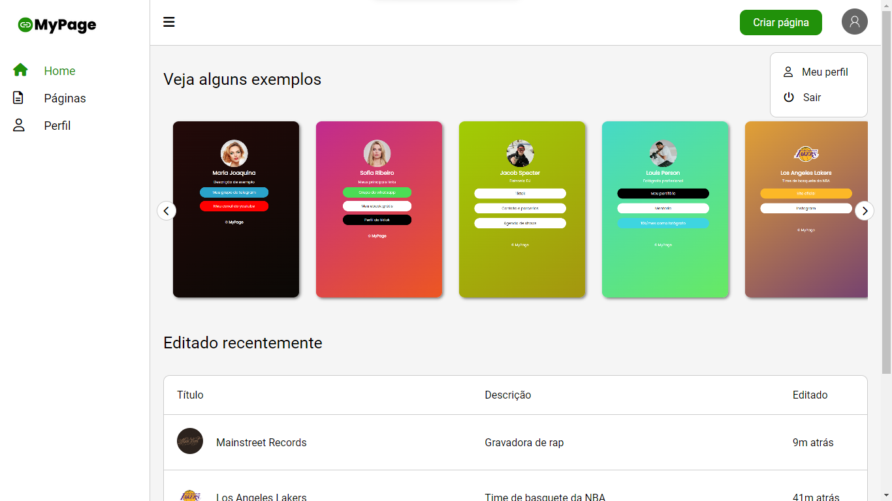

# MyPage - Laravel

Um sistema de criação de páginas de links 100% customizáveis, com painel de controle completo e *Estatísticas* em tempo real.



# Tecnologias utilizadas:

* Blade
* CSS
* Javascript
* PHP
* Laravel
* MySqL

# Requisitos mínimos para rodar o projeto

* <a href="https://php.net" target="_blank">PHP 8</a>
* <a href="https://getcomposer.org" target="_blank">Composer</a>

## rodando na sua máquina

1 - Clonar o projeto
```bash
git clone https://github.com/jadielsanttos/mypage-laravel

# Entre na pasta do projeto
cd mypage-laravel
```

2 - Instalar as dependências
```bash
composer install
```

3 - Criar o arquivo .env para conectar com o banco de dados
```bash
cp .env.example .env
```

4 - Gerar a chave da aplicação
```bash
php artisan key:generate
```

5 - Rodar as migrations
```bash
php artisan migrate
```

6 - Hora de rodar o projeto
```bash
php artisan serve
```
Acesse [http://localhost:8000](http://localhost:8000) e seja feliz
